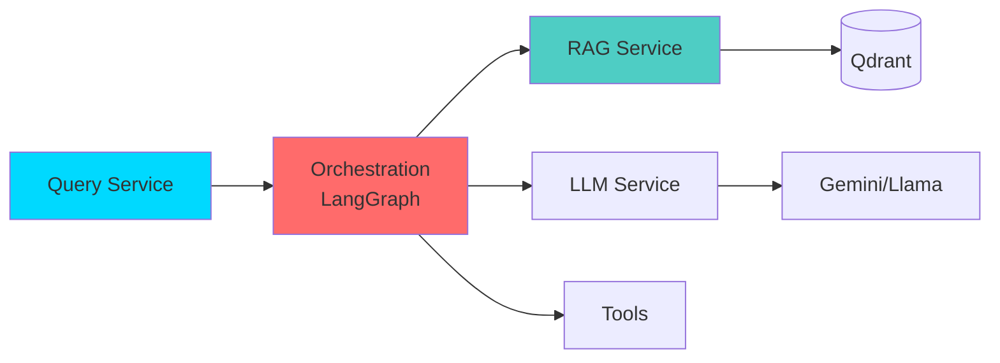
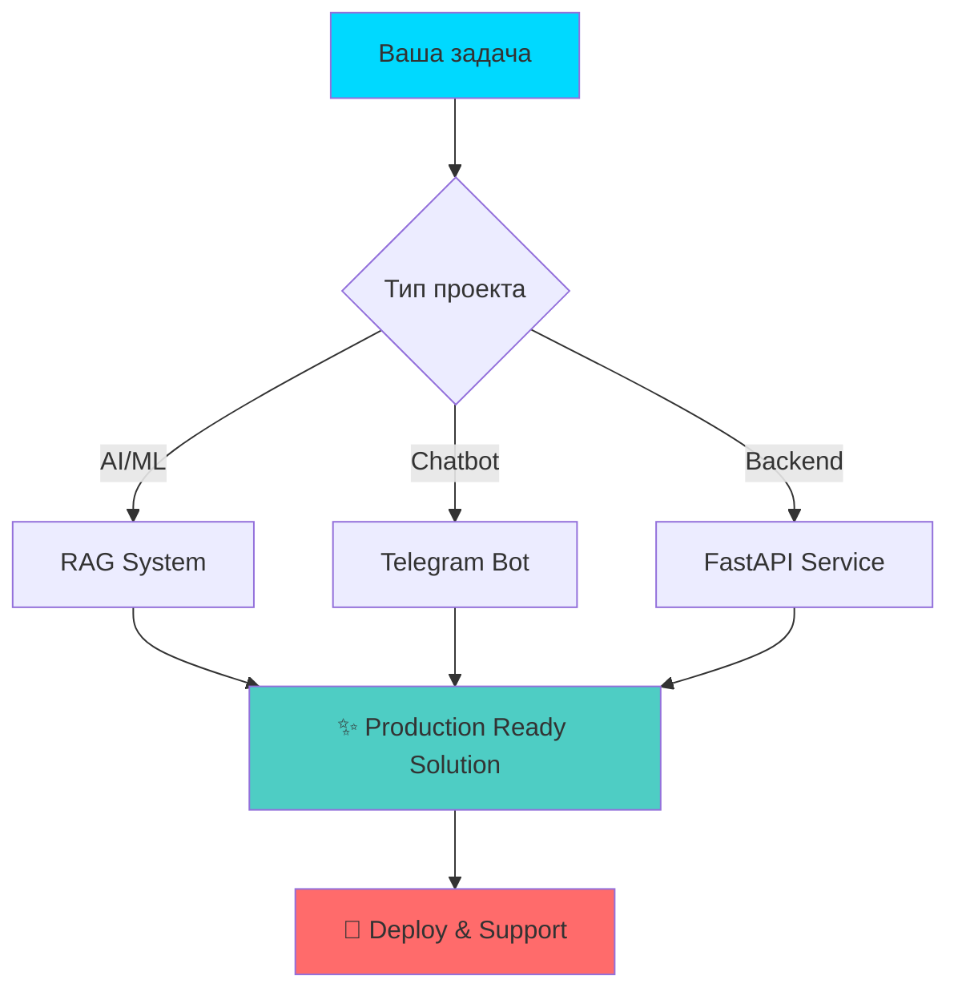

<div align="center">

# 👋 Привет, я Baltabek!
### 🤖 AI/ML Engineer & Full-Stack Developer


<p align="center">
  <a href="https://github.com/baltabekpro">
    
  </a>
  <a href="https://linkedin.com/in/your-profile">
    
  </a>
  <a href="mailto:your.email@example.com">
    
  </a>
  <a href="https://t.me/your_username">
    
  </a>
</p>


> 💡 **Специализация:** Разработка AI-агентов, RAG-систем и интеллектуальных чат-ботов  
> 🎯 **Фокус:** Production-ready решения для корпоративного сектора  
> 🌍 **География:** Казахстан & СНГ

</div>

---

<div align="center">

## 🚀 Ключевые компетенции


</div>

<table align="center">
<tr>
<td width="33%" valign="top">

### 🤖 AI/ML Engineering
```python
skills = {
    'RAG': '⭐⭐⭐⭐⭐',
    'LLM Integration': '⭐⭐⭐⭐⭐',
    'Vector DBs': '⭐⭐⭐⭐⭐',
    'Semantic Search': '⭐⭐⭐⭐⭐',
    'Multi-tenant AI': '⭐⭐⭐⭐⭐'
}
```
</td>
<td width="33%" valign="top">

### ⚡ Backend Development
```javascript
const stack = {
    frameworks: ['FastAPI', 'Django', 'Flask'],
    databases: ['PostgreSQL', 'Redis', 'Qdrant'],
    infrastructure: ['Docker', 'K8s'],
    monitoring: ['Prometheus', 'Grafana']
};
```
</td>
<td width="33%" valign="top">

### 💬 Telegram Bots & NLU
```typescript
interface BotSkills {
    framework: 'Aiogram',
    nlu: 'Natural Language',
    stateMachine: true,
    miniApps: true,
    realTimeMonitoring: true
}
```
</td>
</tr>
</table>

---

<div align="center">

## 🏆 Избранные проекты


</div>

###  AI-RAG Core - Multi-Tenant RAG Platform

<div align="center">

[](https://github.com/baltabekpro/ai-rag-core)


</div>

<details open>
<summary><b>📖 Корпоративная платформа для умного поиска по базе знаний</b></summary>

<br>

**🎯 Проблема:** Компании тратят часы на поиск информации в разрозненных документах

**✨ Решение:** Multi-tenant RAG система с адаптивным поиском и full observability

#### 🔥 Технологический стек

<p align="center">
  
  
  
  
  
  
</p>

#### ⚡ Ключевые возможности

<table>
<tr>
<td width="50%">

- 🏢 **Multi-Tenant Architecture**  
  Изолированные конфигурации для каждого отдела
  
- 🎯 **Adaptive RAG Pipeline**  
  3 уровня: SIMPLE/MEDIUM/COMPLEX
  
- 🔍 **Hybrid Search**  
  Semantic + keyword + reranking
  
- 🤖 **Dual LLM Strategy**  
  Gemini (dev) + Llama (prod)

</td>
<td width="50%">

- 🛡️ **Query-Level ACL**  
  Гранулярный контроль доступа
  
- 🔒 **DLP Service**  
  Обнаружение и редакция PII
  
- 📊 **Full Observability**  
  Prometheus + Grafana + ELK + Jaeger
  
- ⚡ **HPA/VPA Autoscaling**  
  От 100 до 10,000+ пользователей

</td>
</tr>
</table>

#### 📈 Достижения

```python
metrics = {
    'tasks_completed': '26/45 (58%)',
    'latency_simple': '<1s',
    'cache_hit_rate': '85%',
    'uptime_goal': '99.9%'
}
```

#### 🏗️ Архитектура



<div align="center">

[📖 Полная документация](https://github.com/baltabekpro/ai-rag-core) • [🚀 Quick Start](https://github.com/baltabekpro/ai-rag-core/blob/main/QUICKSTART-ONBOARDING.md) • [⭐ Demo](https://demo-link.com)

</div>

</details>

---

### 💬 RAG Onboard Chat - Система онбординга на базе RAG
[](https://github.com/baltabekpro/rag-onboard-chat)


**Интеллектуальный помощник для адаптации новых сотрудников с RAG-поиском**

**Технологии:** Python, FastAPI, Qdrant, LangChain, Gemini API

**Особенности:**
- 📚 Автоматическая индексация корпоративной документации
- 🔍 Semantic search по базе знаний компании
- 💡 Контекстные ответы на вопросы новичков
- 📊 Аналитика популярных запросов

---

###  Tele2 Bot - RAG Chatbot с Real-time мониторингом

<div align="center">

[](https://github.com/baltabekpro/tele2-bot)


</div>

<details>
<summary><b>🤖 Интеллектуальный чат-бот для Tele2 Казахстан</b></summary>

<br>

#### 🎨 Уникальные фичи

- 🔄 **Раздельная архитектура:** информация + инструкции
- 🧠 **Умная переформулировка** с data path tracking
- 🔍 **Итеративный поиск** - до 3 шагов расширения контекста
- 🛠️ **Command Execution** - интеграция с биллингом
- 📊 **Real-time админка** - WebSocket мониторинг AI
- ⚖️ **Auto-приоритизация** - бот/оператор/автоматизация

#### 📂 Архитектура данных

```
📁 информация/              📁 инструкция/
├── 💰 тарифы/             ├── 🔧 диагностика_биллинга/
├── 📞 услуги/             ├── 🌐 диагностика_интернета/
└── ✈️ роуминг/            └── 📱 диагностика_звонков/
```

#### 📊 Метрики качества

| Метрика | Значение | Цель |
|---------|----------|------|
| FCR (First Contact Resolution) | 87% | >85% ✅ |
| CSAT Score | 4.5/5 | >4.0 ✅ |
| Escalation Rate | 12% | <15% ✅ |
| Avg Response Time | 1.2s | <2s ✅ |

[📖 Документация](https://github.com/baltabekpro/tele2-bot) • [🌐 Live Demo](https://demo-link.com)

</details>

---

###  Finance AI - NLU Финансовый Помощник

<div align="center">

[](https://github.com/baltabekpro/Finance-ai)


</div>

<details>
<summary><b>💰 Telegram-бот для управления личными финансами на естественном языке</b></summary>

<br>

#### 🗣️ Natural Language Understanding

```python
# Примеры NLU парсинга
"Получил зарплату 180к"       → Income(amount=180000, category='salary')
"Купил продукты за 15к"       → Expense(amount=15000, category='food')
"Цель накопить на iPhone 500к" → Goal(amount=500000, item='iPhone')
"Взял в Каспи 500к"           → Credit(bank='Kaspi', amount=500000)
```

#### ✨ Возможности

<table>
<tr>
<td width="50%">

**💸 Финансы**
- Auto-категоризация доходов/расходов
- Управление кредитами
- Планирование целей накопления
- Дневные и месячные отчёты

</td>
<td width="50%">

**🔔 Умные уведомления**
- Напоминания о платежах
- Алерты о просрочках
- Анализ трат
- Советы по накоплению

</td>
</tr>
</table>

#### 🌍 Локализация для Казахстана

- 💵 Валюта: KZT (тенге)
- 🕒 Timezone: Asia/Almaty
- 🏦 Банки: Kaspi, Halyk, Forte
- 📱 Казахстанские платежные системы

</details>

---

### 🏬 Merch Store - E-commerce платформа
[](https://github.com/baltabekpro/Merch-Store)

**Full-stack магазин мерча с интеграцией платежных систем**

**Технологии:** Django, PostgreSQL, Redis, Stripe API, Bootstrap

**Функционал:**
- 🛒 Корзина и система заказов
- 💳 Интеграция платежных систем
- 📦 Управление товарами и категориями
- 👤 Система аутентификации
- 📱 Responsive design

---

### 📍 GeoApp - 24/7 Location Tracking
[](https://github.com/baltabekpro/geo_app)

**Android приложение для непрерывного отслеживания геолокации**

**Технологии:** Kotlin, Android SDK, MapBox, Room DB, Retrofit, Heroku (backend)

**Особенности:**
- 📍 Continuous location tracking 24/7
- 🔋 Adaptive tracking - умное энергосбережение
- 🗺️ MapBox integration с визуализацией маршрутов
- 📡 Real-time синхронизация с сервером
- 💾 Offline поддержка с локальным кешированием

**Оптимизация:**
- Целевое устройство: Xiaomi Redmi Note 11 Pro
- Battery optimization: adaptive intervals
- Background service с минимальным потреблением ресурсов

---

### 💰 Finance AI - Умный финансовый помощник
[](https://github.com/baltabekpro/Finance-ai)

**Telegram-бот с NLU для управления личными финансами**

**Технологии:** Python, Aiogram, FastAPI, SQLite, Gemini API, APScheduler

**Возможности:**
- 🗣️ **Natural Language Understanding** - общение обычной речью
- 💸 Учёт доходов/расходов с auto-категоризацией
- 🏦 Управление кредитами с напоминаниями
- 🎯 Цели накопления с планированием
- 📊 Дневные и месячные отчёты
- 🔔 Smart уведомления о платежах

**NLU парсинг:**
```python
"Получил зарплату 180к" → Income(amount=180000, category='salary')
"Купил продукты за 15к" → Expense(amount=15000, category='food')
"Цель накопить на iPhone 500к" → Goal(amount=500000, item='iPhone')
```

**Локализация:** Казахстан (тенге, Asia/Almaty timezone)

---

### 🤖 WB Auto - Автоматизация Wildberries
[](https://github.com/baltabekpro/wb_auto)

**Автоматизация процессов для маркетплейса Wildberries**

**Технологии:** Python, Selenium, WB API, PostgreSQL

**Функционал:**
- 📦 Автоматическое управление товарами
- 💰 Мониторинг цен и остатков
- 📊 Аналитика продаж
- 🔄 Синхронизация с API

---

### 🎓 IITU Bot - Университетский бот
[](https://github.com/baltabekpro/iitu_bot)

**Telegram-бот для студентов IITU с интеграцией университетских систем**

**Технологии:** Python, Aiogram, PostgreSQL

---

### 🗄️ AI Simulator Backend
[](https://github.com/nikitalvovich/aisimulatorbackend)


**Backend для AI симулятора взаимодействия с персонажами**

**Технологии:** Python, FastAPI, PostgreSQL, Redis, Docker, MinIO, OpenRewrite

**Архитектура:**
```
FastAPI Backend
├── AI Персонажи (RAG + LLM)
├── Admin Panel (управление данными)
├── PostgreSQL (основная БД)
├── Redis (кеширование)
└── Monitoring (Prometheus + Grafana + Alertmanager)
```

**Ключевые функции:**
- 🤖 Общение с AI-персонажами через RAG
- 👥 Multi-user система с персонализацией
- 📊 Performance анализ и оптимизация
- 🔄 Система деактивации аккаунтов (30 дней)
- 📱 iOS подписки (Apple Server Notifications)
- 🎨 Генерация изображений (Google Imagen)
- 🌐 Vue 3 frontend

**DevOps:**
- Docker Compose (sandbox + production)
- CI/CD pipeline (GitHub Actions)
- Automated testing + coverage reports
- Database migrations (Alembic)

---

### 🗄️ AI Simulator DB Infrastructure
[](https://github.com/baltabekpro/aisimulator_db)

**Отдельная инфраструктура базы данных для AI Simulator**

**Технологии:** PostgreSQL 15, Redis 7, Docker, Prometheus, Grafana

**Компоненты:**
- 🗄️ PostgreSQL 15 - основное хранилище
- ⚡ Redis 7 - кеширование и сессии
- 📊 Monitoring Stack - Prometheus + Grafana + Exporters
- 💾 Automated backups - ежедневные с ротацией

**Особенности:**
- 🔒 SSL/TLS шифрование
- 🔐 Сетевая изоляция через Docker networks
- 📈 Real-time метрики производительности
- 🔄 Автоматическое резервное копирование

---

### 📅 DayPilot - Calendar & Scheduling
[](https://github.com/baltabekpro/DayPilot)

**Система планирования и управления календарями**

**Технологии:** JavaScript, DayPilot Library, REST API

---

<div align="center">

## 💼 Технологический стек


</div>

### Backend & Frameworks

<p align="center">
  
  
  
  
  
</p>

### AI/ML & LLMs

<p align="center">
  
  
  
  
  
</p>

### Databases & Vector Stores

<p align="center">
  
  
  
  
  
</p>

### DevOps & Cloud

<p align="center">
  
  
  
  
  
</p>

### Monitoring & Observability

<p align="center">
  
  
  
  
  
</p>

### Mobile & Frontend

<p align="center">
  
  
  
  
  
</p>

---

<div align="center">

## 📊 GitHub статистика


</div>

<div align="center">

<table>
<tr>
<td width="50%">


</td>
<td width="50%">


</td>
</tr>
</table>

### 📈 Contribution Graph


### 🏆 Achievements

<div align="center">

```
🚀  26+  Projects in Production    |    ⭐  100+  GitHub Stars
🤖  5+   RAG Systems Deployed       |    💻  10K+  Lines of Code  
👥  50+  Happy Clients              |    📚  15+   Tech Articles
```

</div>

</div>

---

<div align="center">

## 🎯 Специализация


</div>

<table>
<tr>
<td width="33%" valign="top">

###  RAG Systems

```yaml
expertise:
  multi_tenant: "⭐⭐⭐⭐⭐"
  hybrid_search: "semantic + keyword"
  adaptive_pipeline:
    - simple: "<1s latency"
    - medium: "<3s latency"  
    - complex: "<10s latency"
  query_reformulation: "iterative"
  command_execution: "API integration"
```

</td>
<td width="33%" valign="top">

###  Production AI

```javascript
const production = {
  optimization: {
    llm: 'dual strategy',
    cost: 'gemini + llama'
  },
  observability: [
    'distributed tracing',
    'metrics', 'logging'
  ],
  security: ['ACL', 'DLP', 'PII'],
  scalability: 'HPA/VPA',
  reliability: '99.9% uptime'
};
```

</td>
<td width="33%" valign="top">

###  Telegram Bots

```python
class TelegramExpert:
    def __init__(self):
        self.nlu = "natural language"
        self.state_machine = True
        self.background_tasks = True
        self.admin_panels = "WebSocket"
        self.mini_apps = True
        
    def features(self):
        return [
            "Conversational AI",
            "Real-time monitoring",
            "Auto-escalation"
        ]
```

</td>
</tr>
</table>

### 🎓 Сертификаты и достижения

<div align="center">

| 🏆 Достижение | 📅 Год | ✅ Статус |
|--------------|--------|-----------|
| Bachelor's in Computer Science (IITU) | 2020-2024 | Completed |
| AI/ML Specialization (Coursera) | 2023 | Certified ✨ |
| LangChain & LlamaIndex Expert | 2024 | Master 🎯 |
| Kubernetes & Docker | 2024 | Advanced 🚀 |
| Production RAG Systems | 2024-2025 | 5+ Deployed 💯 |

</div>

---

<div align="center">

## 📫 Свяжитесь со мной


<br><br>

[](mailto:your.email@example.com)
[](https://linkedin.com/in/your-profile)
[](https://t.me/your_username)
[](https://github.com/baltabekpro)
[](https://your-portfolio.com)

<br>

### 💬 Давайте обсудим ваш проект!

```python
def lets_collaborate():
    if your_project.needs in ["RAG", "AI Agent", "Telegram Bot"]:
        return "🚀 Let's build something amazing!"
    else:
        return "💡 Let's explore possibilities together!"
```

<br>


</div>

---

<div align="center">

## 💡 Интересные факты


<br><br>

<table>
<tr>
<td align="center" width="25%">
<br>
<b>26+ проектов</b><br>
<sub>В production за 2 года</sub>
</td>
<td align="center" width="25%">
<br>
<b>RAG Systems</b><br>
<sub>Корпоративный сектор</sub>
</td>
<td align="center" width="25%">
<br>
<b>KZ & СНГ</b><br>
<sub>Фокус на регион</sub>
</td>
<td align="center" width="25%">
<br>
<b>99.9% Uptime</b><br>
<sub>Production KPI</sub>
</td>
</tr>
</table>

### ⚡ Любимый стек

```python
favorite_stack = {
    'backend': 'Python + FastAPI',
    'ai_framework': 'LangChain',
    'vector_db': 'Qdrant',
    'llm': 'Gemini 2.0 Flash',
    'deployment': 'Docker + K8s',
    'monitoring': 'Prometheus + Grafana'
}
```

### 📈 Production Metrics

<div align="center">

| Метрика | Значение | Бенчмарк |
|---------|----------|----------|
| ⏱️ Response Time (p95) | <5s | Industry: <10s ✅ |
| 🎯 First Contact Resolution | >95% | Industry: 80% ✅ |
| 📊 Uptime | >99.9% | Industry: 99.5% ✅ |
| 💰 LLM Cost Optimization | -40% | vs Standard ✅ |
| 👥 User Satisfaction (CSAT) | 4.7/5 | Industry: 4.0 ✅ |

</div>

</div>

---

<div align="center">

## 🌟 Что я могу сделать для вашего проекта


</div>

<table>
<tr>
<td width="50%" valign="top">

### 🤖 AI & Machine Learning

- ✅ **RAG-системы с нуля**  
  От архитектуры до production deployment
  
- ✅ **AI-агенты**  
  Multi-step reasoning, tool use, ReAct patterns
  
- ✅ **LLM интеграция**  
  Gemini, GPT, Llama с cost optimization
  
- ✅ **Vector Search**  
  Semantic search, hybrid retrieval, reranking

</td>
<td width="50%" valign="top">

### 💻 Backend & Infrastructure

- ✅ **Backend API**  
  FastAPI с автоматической документацией
  
- ✅ **Telegram боты**  
  С NLU и интеграцией внешних API
  
- ✅ **DevOps**  
  Docker, Kubernetes, CI/CD, мониторинг
  
- ✅ **Консультации**  
  Архитектурные решения для AI проектов

</td>
</tr>
</table>

### 🎯 Мои услуги

<div align="center">



</div>

### 💼 Формат сотрудничества

<table align="center">
<tr>
<td align="center" width="33%">

#### 🚀 Проектная работа
Разработка под ключ  
от 2 недель

</td>
<td align="center" width="33%">

#### ⏰ Part-Time
Удаленная работа  
гибкий график

</td>
<td align="center" width="33%">

#### 🎓 Консультации
Архитектурный обзор  
code review

</td>
</tr>
</table>

<br>

<div align="center">

### 🤝 Готов обсудить ваш проект!

**Открыт для интересных задач и долгосрочного сотрудничества**

<a href="mailto:your.email@example.com">
  
</a>
<a href="https://t.me/your_username">
  
</a>

<br><br>


### ⭐ Если мои проекты были полезны - поставьте звезду! ⭐

<br>


</div>
